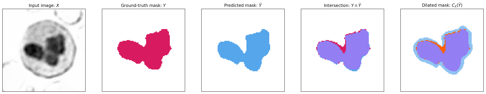
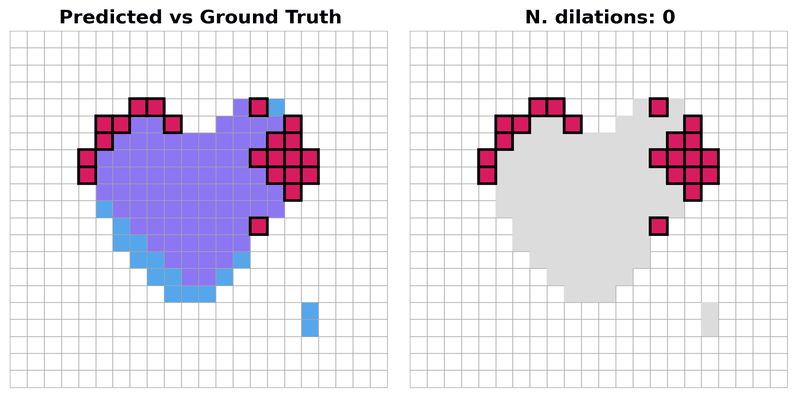
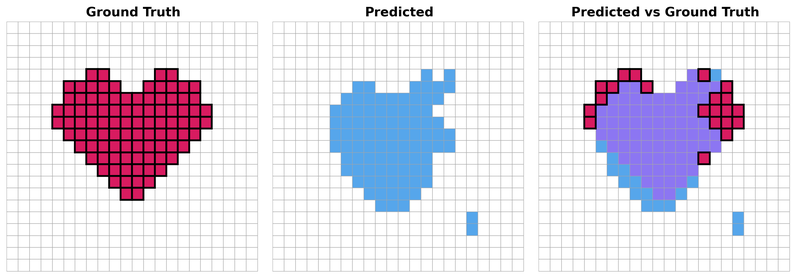

# Conformal Prediction for Image Segmentation Using Morphological Prediction Sets

[](https://arxiv.org/abs/2503.05618)
[](https://doi.org/10.1007/978-3-032-04965-0_8)
[](#citation)
[](assets/Mossina_and_Friedrich_2025_poster.pdf)

Accepted at [**MICCAI 2025**](https://conferences.miccai.org/2025/en/default.asp). 
Official code for the paper *"Conformal Prediction for Image Segmentation Using Morphological Prediction Sets"*.


[Luca Mossina](https://scholar.google.com/citations?hl=en&user=SCpz8XMAAAAJ),¹ [Corentin Friedrich](https://scholar.google.com/citations?user=w6oH0xUAAAAJ&hl=en)¹

¹ [IRT Saint Exupéry](https://www.irt-saintexupery.com/smart-technologies/). [Toulouse](https://www.toulouse-tourisme.com/en), France  

- Research Lab: [DEEL](https://www.deel.ai), *Dependable, Explainable & Embeddable Learning* for trustworthy AI
- DEEL's [open-source software](https://github.com/deel-ai)
- DEEL's [publications](https://www.deel.ai/publications/)


## Idea
Visual example of our conformal margin: we build a morphological margin (via dilation) that covers all missed pixels (false negatives). Dataset: [WBC](#sources)



### Synthetic example

The animation shows a sequence of **four dilations** by a $(3 \times 3)$ cross structuring element, which expand the margin of the predicted mask (darker blue, see fig. below).
Four iterations is the minimal number of iterations needed, i.e. the _nonconformity score_ for this specific image: all missing pixels are recovered with 4 iterations (shown in orange).



In the following image, we have a ground truth mask (in red) and a predicted mask (in blue). 
In purple, we have the pixels that were correctly predicted. The remaining red ones, are false negatives, i.e. pixels that belong to the ground truth but were not predicted.




## Method
We use [morphological operations](https://en.wikipedia.org/wiki/Mathematical_morphology) (dilation, sequences of dilations, etc.) to add a margin $\mu_{\lambda}(\hat{Y})$ around a predicted (binary) segmentation mask $\hat{Y}$, such that the ground-truth mask $Y$ is covered with high probability, and false negative pixels are statistically controlled.
(Hence the repo's name, **consema** = Conformalized Segmentation Margins).

To make this statistically rigorous, we use [**conformal prediction**](https://arxiv.org/abs/2107.07511): using calibration data, we find the minimal number of dilations $\lambda$ (applied to the predicted mask) needed to cover the ground truth, on average.
We write $\delta^{\lambda}(\hat{Y})$ to say that we apply dilation $\lambda$ times, at each step adding a margin of pixels to the predicted mask $\hat{Y}$.
The choice of structuring element (e.g., a cross, square, or disk) is arbitrary, the users can craft any kind of element or sequence of operations,
as long as $\hat{Y}$ can "grow" in all directions and cover the whole ground truth mask $Y$.

This gives us a **prediction set** $C_{\lambda}(\hat{Y}) = \hat{Y} \cup \mu_{\lambda}(\hat{Y}) = \delta^{\lambda}(\hat{Y})$, which is a set of pixels that are either predicted or added by the dilation operation. The prediction set is guaranteed to cover the ground truth with a user-defined probability $\geq 1 - \alpha$, e.g., 90%:

$$\mathbb{P}(Y \subseteq C_{\lambda}(\hat{Y})) \geq 1 - \alpha$$


This is a **nonparametric** method, which does not require any training or hyperparameter tuning, and is **model-agnostic**: it can be applied to any segmentation model, including **deep learning** models, **classical methods**, or even **human annotators**.

- **requirement**: having a set of (previously unseen) **annotated** calibration pairs $(X_i, Y_i)_{i=1}^n$, that are i.i.d. samples from the same distribution as the test data.


## Getting started

```
$ make install
```


## Examples
The directory [notebooks](/notebooks) contains complete examples for the datasets:
- [WBC](/notebooks/n201_consema_wbc.ipynb) and [OASIS](/notebooks/n202_consema_oasis.ipynb), using the _UniverSeg_ segmentation model
- [polyps](/notebooks/n203_consema_polyps.ipynb) tumors dataset, using _PraNet_ (we use precomputed predictions as distributed by [A. Angelopoulos](https://github.com/aangelopoulos/conformal-prediction/blob/67f506e4880e192ef9fc6a2de73e21b277f8c544/notebooks/tumor-segmentation.ipynb).


## Sources
Starting points for datasets:
- [WBC](https://github.com/zxaoyou/segmentation_WBC), via [universeg repo](https://github.com/JJGO/UniverSeg/blob/833a0c34c65e38d675e21bd48ddec6797cc03259/example_data/wbc.py#L55)
- [OASIS](https://sites.wustl.edu/oasisbrains/), via [universeg repo](https://github.com/JJGO/UniverSeg/blob/833a0c34c65e38d675e21bd48ddec6797cc03259/example_data/oasis.py#L71) 
- polyps tumor data, via [aangelopoulos/conformal-prediction repo](https://github.com/aangelopoulos/conformal-prediction/blob/67f506e4880e192ef9fc6a2de73e21b277f8c544/notebooks/tumor-segmentation.ipynb)

Models used:
- UniverSeg: [code](https://github.com/JJGO/UniverSeg), [paper](https://arxiv.org/abs/2304.06131)
- PraNet: [paper](https://link.springer.com/chapter/10.1007/978-3-030-59725-2_26), via [aangelopoulos/conformal-prediction repo](https://github.com/aangelopoulos/conformal-prediction/blob/67f506e4880e192ef9fc6a2de73e21b277f8c544/notebooks/tumor-segmentation.ipynb)

For full bibliographic references, see the [*Experiments* section in our paper](https://arxiv.org/pdf/2503.05618?#section.4).


## License
[MIT License](LICENSE) © 2025 [IRT Saint Exupéry](https://www.irt-saintexupery.com/).


## Acknowledgements
Part of the DEEL project on trustworthy AI ([deel.ai](https://www.deel.ai)).


## Citation

```
@InProceedings{Mossina_2025_conformal_morpho,
    title={Conformal Prediction for Image Segmentation Using Morphological Prediction Sets},
    author={Mossina, Luca and Friedrich, Corentin},
    booktitle={Medical Image Computing and Computer Assisted Intervention -- MICCAI 2025},
    year={2026},
    publisher={Springer Nature Switzerland},
    address={Cham},
    pages={78--88},
}

```
